# Procedure

To complete this project I used the Windows VM provided.
I downloaded the remote connection tool and started the machine.
With Windows running, I took snapshots using the online manager, which allowed me to take snapshots with all of the testing programs running before launching evil.exe.

The testing programs launched to monitor are listed here:

 - Process Monitor: Lists actions of processes, timestamped
 - Process Explorer: Displays processes in nested form to show parent processes
 - Flypaper: Disallows programs to exit
 - FakeNet: Prevents internet, instead collects all traffic
 - AntiSpy: General analysis, used for registries

Using the testing software, along with built-in Windows tools, I ran evil.exe multiple times to get a sense of what it was doing.

# Findings

Using the tools provided I launched the evil.exe.
Using the process monitor I scrolled through the effects of this program.
Initially this program provides the following box.

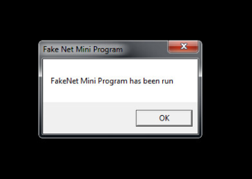{ width=250px }

Clicking okay, or not, doesn't have any affect, as the program has already started to execute its code.
The first step that I could see was that it spawned multiple other programs.
The programs I saw were

  - tongji2.exe
  - svchest.exe
  - pao.exe

These programs do a couple different things.
Evil.exe reads a lot of registries, and intermittently writes to new files.
Maybe the program is using ROP or some other string building to build files.
Through this method it creates svchest.exe and pao.exe.
The pao program is then copied to the tongji2 program.
These files are mostly created from downloading files from a Chinese server.
First evil.exe checks the internet with blank[1].gif, pulled from a naver.com.
This is just a Korean search engine, queried here:

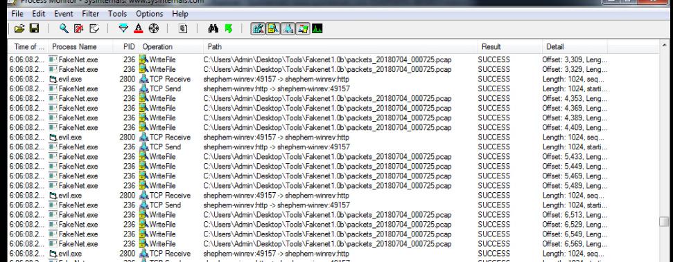{ width=200px }

For the lab it has been redirected to this image:

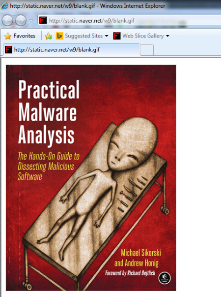{ width=200px }

Once it confirms internet connection, it will then start downloading more programs, the server that it downloads from is shown through the capture in Figure 4.

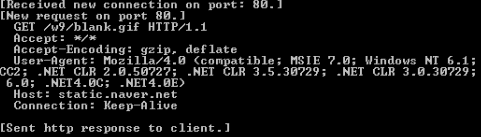{ width=300px }

These requests go to timeless888.com, potentially the server of the attackers.
Searches about this website led me to some more information about evil.exe.
Through research I was able to determine that the original malware was used to attack Korean banks(@blog).
Using this information I was able to find where evil.exe changed.
It altered the webpage host file, which makes any queries to several bank sites redirect to the attackers server.
Evil.exe created system.yf in Figure 5, which is used in appending domains to the host file in Figure 6.

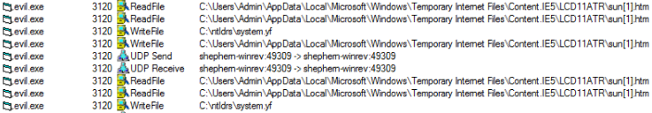{width=300px}

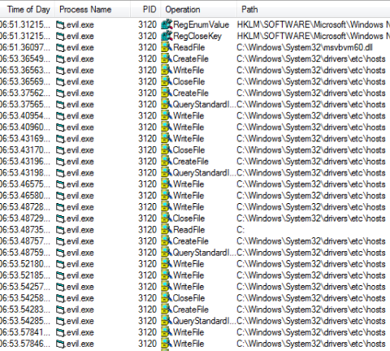{ width=400px }

I learned of appending domains from the article(@blog), but wanted to confirm that they were actually being added.
In Figure 7, the file is in the process of changing, but I think there may have been an issue, and I wasn't able to find the domains that supposedly had been appended.
Regardless the domains have been changed, and at this point evil.exe makes a copy of itself in svchest.exe.
It also made multiple files within the temporary network folder on the system, to fill the files created earlier.
These can be seen in Figure 8.

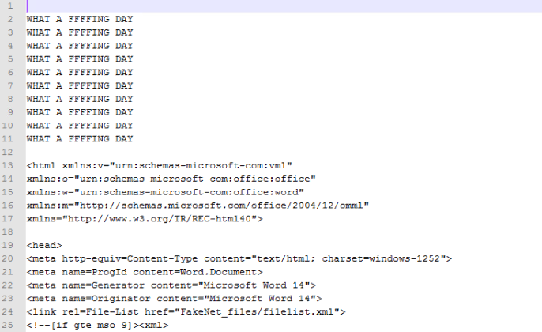{ width=300px }

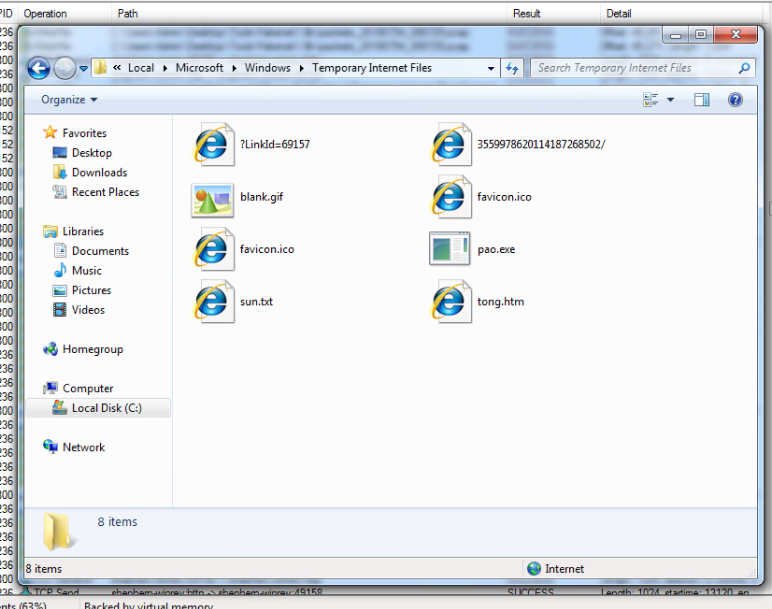

Without launching poa.exe, I was able to analyze the binary of the executable.
I wasn't able to find any information, other than the fact that it was definitely shady, seen in Figure 9.

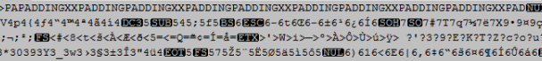{ height=50px }

The pao.exe program is infact a what the tongji2 program is copied from.
The tongji2 program launches Internet Explorer, but it also seems to be launched by Internet Explorer(Figure 10).
This is most likely to imbed a permanent version within Internet Explorer, to prevent any removal.

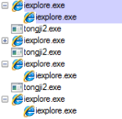{ width=150px }

The tongji2 program seems to be the higher level of this malware, maybe it actually redirects the traffic, where the svchest.exe does the exploit.
A final act of evil.exe is to make the copy svchest.exe, launch on startup.
This is done by creating a HKEY called skunser, with a path to svchest.exe, as shown in Figure 11.

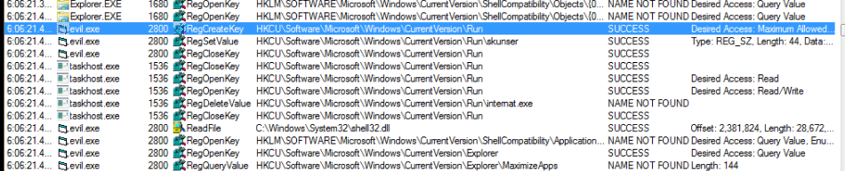{ width=200px }

This means that on launch you get the same message as in Figure 1, and svchest launches.
The svchest program is slightly different, as it creates both system.yf and another file funbots.bat, shown in Figure 12.
This file creates a task schedule that will run the svchest program downloader every 30 minutes.
I guess that this could be a protection method, so that even deleting the program wouldn't fix the issue.

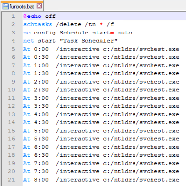{ width=200px }

# Conclusion

The program evil.exe, also seen as sun.exe, creates and downloads files from the site timeless888.com.
The main goal is to redirect bank traffic on Internet Explorer to the attackers server, leaking user bank information.
The program sets itself as a launch program and integrates itself to launch with Internet Explorer.

# References
