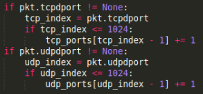
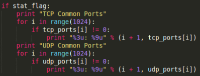
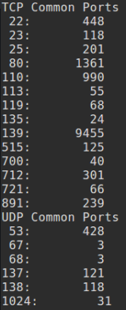
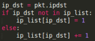
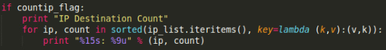
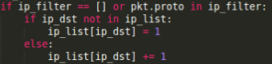
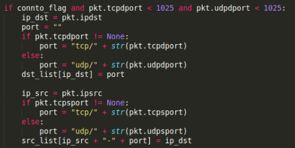
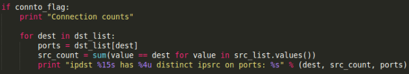

# Procedure

1. In part 1, I wrote additional python to display the common UDP and TCP destination ports.  It was easy enough to work around the CSV helper file, and count a total for both UDP and TCP.  The only challenge I faced was making sure the None data type was accounted for.  The following code is what I wrote in:

{ width=250px }

{ width=250px }

Below is the actual output of the R.csv file.

{ width=69px }

2. For the uses of each network I looked at the majority of the ports being used.
For the O network, we see the following large uses:
- 22/TCP: 26,383...ssh
- 25/TCP: 211,205..smtp, mail
- 53/UDP: 21,563...domain
- 80/TCP: 156,397..http, WWW
- 445/TCP: 10,867..microsoft-ds, Microsoft Naked CIFS

Looking these up, it seems that this network was used mainly for emails and web browsing.  It most likely is a home network or a business.

For the R network, the following totals stand out:

- 53/UDP: 428....domain
- 139/TCP: 9455..netbios-ssn

This network has much less traffic than the O network, but is somehow associated with file sharing, because that is the 139 port.
I might assume that this is a small piece of a server or data center.

3. To count the ip addresses I added a dictionary, using the address as the key and the count as the value.
This is the code I wrote:

{ width=200px }

{ width=400px }

4. The code printed out the address counts and I was able to record the most requested addresses.
For the O network, the following are the top three addresses:
- 192.245.12.230 - total 60,866
- 192.245.12.242 - total 69,056
- 192.245.12.221 - total 118,662

These could be corporate lan addresses, which does sound like a business.

For the R network, the following are the top three addresses:
  - 10.5.63.231 - 6,974
  - 10.5.63.230 - 16,073
  - 234.142.142.142 - 42,981

I'm not sure what the 10 subnet might mean, but 234.142.142.142 is used to copy files from servers to clients on a local network.  This does assist my idea that it might be a small server, or business router.

5. The most common prefix in network R is 10.5.63, while the most common prefix in network O is 192.245.12.

6. I implemented the additional code, just making the counter ignore any filtered out protocols.
Here is the code implemented:

{ width=200px }

{ width=200px }

7. Running the countip function with filtering I found that the predominant prefix for the O network filtered on GRE is 209, filtered on IPSEC is 146, and filtered on OSPF is 207.182.35.
When filtering the R network traffic on GRE, IPSEC, or OSPF, there turns out to be no traffic for any of those protocols.

8. With both the O network and the R network not having very many OSPF packets, I can guess that neither of them are routers.  This is what I had earlier thought, so it does strengthen my guesses.

9. Although I did implement this section, either it didn't work, or I just wasn't able to understand the instructions.
The code I added is below:

{width=200px}

{width=400px}

With the code running, even if incorrectly, I managed to get the following output:

{ width=200px }

 10.  From the R network, the most connected to port is 10.5.63.6, which connects under UDP 53.  This is a domain request, which makes sense if this is a web browsing computer. From the O network, the ip address 192.245.12.234 was the most connected to, using TCP on port 25.  This makes sense if it is a mail server, or file transfer.
